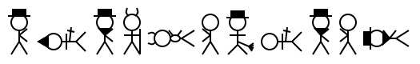

# Daniel Swanson's Link Collection Point

I am a PhD student in Computational Linguistics at Indiana University Bloomington studying machine-assisted annotation and translation for low-resourced and ancient languages. I have been a developer with the machine translation group [Apertium](https://apertium.org/) since 2019.

## Journal Articles

Khanna, Tanmai, Washington, Jonathan N, Tyers, Francis M, Bayatlı, Sevilay, Swanson, Daniel G, Pirinen, Tommi A, Tang, Irene, and Alòs i Font, Hèctor, 2021 _Recent advances in Apertium, a free/open-source rule-based machine translation platform for low-resource languages. Machine Translation_ In Machine Translation [link](https://doi.org/10.1007/s10590-021-09260-6)

Swanson, Daniel and Howell, Nick, 2021 _Lexd: A Finite-State Lexicon Compiler for Non-Suffixational Morphologies_ In Hämäläinen, M., Partanen, N., Alnajjar, K. (eds.) Multilingual Facilitation [pdf](https://helda.helsinki.fi/bitstream/handle/10138/327807/13_Swanson_Howell_Multilingual_Facilitation.pdf?sequence=2)

## Book Chapters

Swanson, Daniel G. _Apertium_. Rule-Based Language Technology, edited by Arvi Hurskainen et al., Northern European Association for Language Technology, 2023, pp. 95–111. [pdf](https://dspace.ut.ee/bitstream/handle/10062/89595/7-RBLT-Apertium.pdf)

## Conference Presentations

Alexandra O’Neil, Daniel Swanson, and Shobhana Chelliah. 2024. _Computational Language Documentation: Designing a Modular Annotation and Data Management Tool for Cross-cultural Applicability_. In Proceedings of the 2nd Workshop on Cross-Cultural Considerations in NLP, pages 107–116, Bangkok, Thailand. Association for Computational Linguistics. [pdf](https://aclanthology.org/2024.c3nlp-1.9.pdf)

Daniel G. Swanson, Bryce D. Bussert, and Francis Tyers. 2024. _Towards Named-Entity and Coreference Annotation of the Hebrew Bible_. In Proceedings of the Third Workshop on Language Technologies for Historical and Ancient Languages (LT4HALA) @ LREC-COLING-2024, pages 36–40, Torino, Italia. ELRA and ICCL. [pdf](https://aclanthology.org/2024.lt4hala-1.5.pdf)

Robert Forkel, Daniel G. Swanson, and Steven Moran. 2024. _Converting Legacy Data to CLDF: A FAIR Exit Strategy for Linguistic Web Apps_. In Proceedings of the 2024 Joint International Conference on Computational Linguistics, Language Resources and Evaluation (LREC-COLING 2024), pages 3978–3982, Torino, Italia. ELRA and ICCL. [pdf](https://aclanthology.org/2024.lrec-main.353.pdf)

Daniel G. Swanson, Bryce D. Bussert, and Francis Tyers. 2024. _Producing a Parallel Universal Dependencies Treebank of Ancient Hebrew and Ancient Greek via Cross-Lingual Projection_. In Proceedings of the 2024 Joint International Conference on Computational Linguistics, Language Resources and Evaluation (LREC-COLING 2024), pages 13074–13078, Torino, Italia. ELRA and ICCL. [pdf](https://aclanthology.org/2024.lrec-main.1145.pdf)

Elizabeth Gabel, Holly Redman, Daniel Swanson, and Sandra Kübler. 2023. _IU-Percival: Linear Models for Sexism Detection_. Working Notes of CLEF 2023 – Conference and Labs of the Evaluation Forum. [pdf](https://ceur-ws.org/Vol-3497/paper-079.pdf)

Alexandra O’neil, Daniel Swanson, Robert Pugh, Francis Tyers, and Emmanuel Ngue Um. 2023. _Comparing methods of orthographic conversion for Bàsàá, a language of Cameroon_. In Proceedings of the Fourth workshop on Resources for African Indigenous Languages (RAIL 2023), pages 97–105, Dubrovnik, Croatia. Association for Computational Linguistics. [pdf](https://aclanthology.org/2023.rail-1.11.pdf)

Daniel Swanson, Tino Didriksen, and Francis M. Tyers. 2023. _WITH Context: Adding Rule-Grouping to VISL CG-3_. In Proceedings of the NoDaLiDa 2023 Workshop on Constraint Grammar - Methods, Tools and Applications, pages 10–14, Tórshavn, Faroe Islands. Association of Computational Linguistics. [pdf](https://aclanthology.org/2023.nodalida-cgmta.2.pdf)

Hossep Dolatian, Daniel Swanson, and Jonathan Washington. 2022. _A Free/Open-Source Morphological Transducer for Western Armenian_. In Proceedings of the Workshop on Processing Language Variation: Digital Armenian (DigitAm) within the 13th Language Resources and Evaluation Conference, pages 1–7, Marseille, France. European Language Resources Association. [pdf](https://aclanthology.org/2022.digitam-1.1.pdf)

Daniel Swanson and Francis Tyers. 2022. _A Universal Dependencies Treebank of Ancient Hebrew_. In Proceedings of the Thirteenth Language Resources and Evaluation Conference, pages 2353–2361, Marseille, France. European Language Resources Association. [pdf](https://aclanthology.org/2022.lrec-1.252.pdf)

Daniel Swanson and Francis Tyers. 2022. _Handling Stress in Finite-State Morphological Analyzers for Ancient Greek and Ancient Hebrew_. In Proceedings of the Second Workshop on Language Technologies for Historical and Ancient Languages, pages 108–113, Marseille, France. European Language Resources Association. [pdf](https://aclanthology.org/2022.lt4hala-1.15.pdf)

Murphy, Kevin, Stern, Nathaniel Ziv, Swanson, Daniel, Ho, Caleb, and Washington, Jonathan, 2020 _UltraTrace: A free/open-source cross-platform tool for manual annotation of ultrasound tongue imaging data_ In UltraFest IX [pdf](https://ultrafest2020.indiana.edu/abstracts/UltraFest_IX__Murphy_Stern_Swanson_Ho_Washington_UltraTrace.pdf)

## Other Articles

Swanson, Daniel, 2021 _Inter-Lingual Personal Script_ Speculative Grammarian [link](https://specgram.com/CLXXXIX.2/10.swanson.ilps.html)

## Conlangs

[Blog](https://crazyninjageeks.wordpress.com/2015/11/28/introduction-to-kayfdanfsantaptvlirtsangbesputvombngagtvlimpkayfsnafkayfgaf-boptvegpdaffshofbompvlimpgafvlimpgaf/)

[YouTube channel](https://www.youtube.com/channel/UCDEnQPb2DGDdozI6kOCHPfw) (mostly language lessons)

## Other Pages

[Github](https://github.com/mr-martian)

[Google Scholar](https://scholar.google.com/citations?user=6r85rhgAAAAJ&hl=en)

[ORCID](https://orcid.org/0000-0002-9847-8111)
